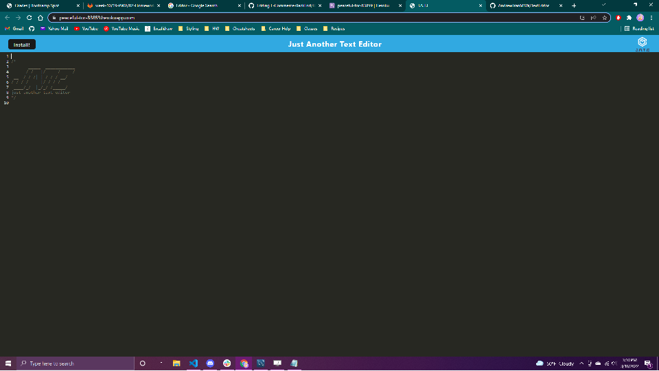

# JATE-TextEditor
Build a text editor that runs in the browser from starting code. The app will be a single-page application that meets the PWA criteria.

## Overview:
Initially started without a repo, so I had to figure out to to set one up afterwards. And deploying to heroku this time was an actual breeze.

## Screenshot:

### [GitHub](https://github.com/Acanthodoris/JATE-TextEditor)
### [Heroku](https://peaceful-tor-83859.herokuapp.com/)

## Technologies Used:
- JavaScript
- Node.js
- Express.js
- Webpack